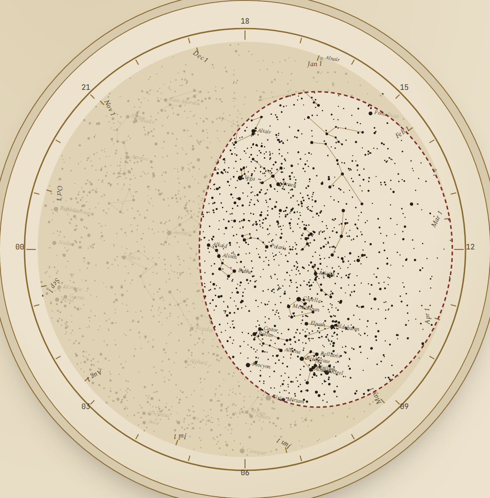
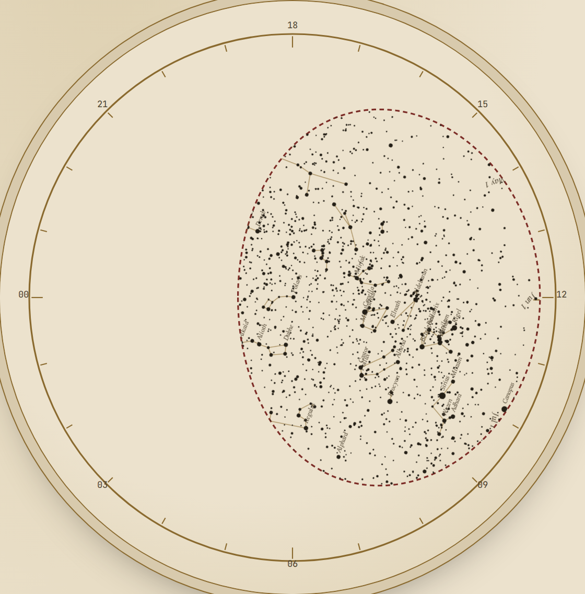
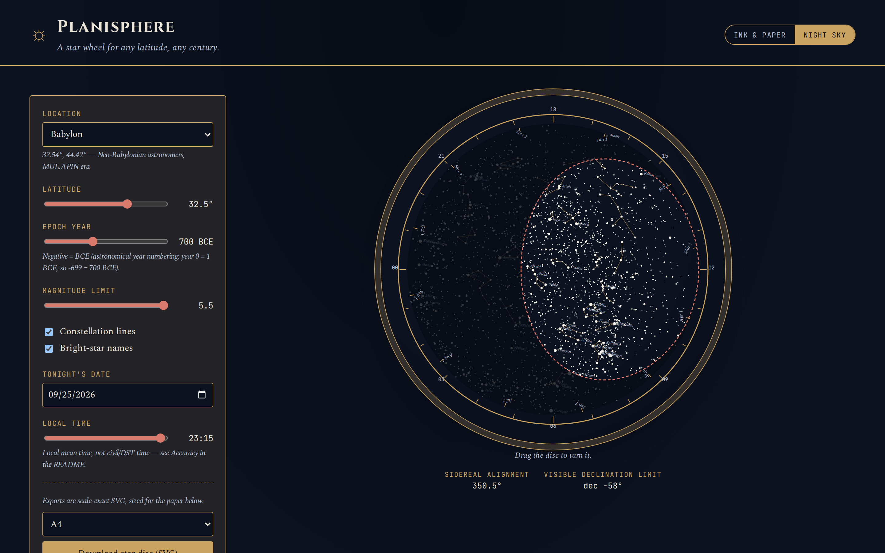
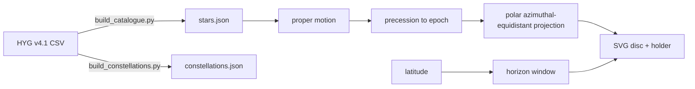

# Planisphere

**Print a star wheel for any latitude and any century.** See the sky over
Babylon in 700 BCE, then cut it out and turn it.

[](LICENSE)
[](https://antonsoo.github.io/planisphere/)

A planisphere is a rotating star chart: dial in a date and time and a window
shows the stars above your horizon. Every commercial one is printed for one
latitude and the present epoch. This app generates an accurate, printable,
laser-cuttable planisphere for **any latitude** and **any epoch from 3000
BCE to 3000 CE** — precession and proper motion included — so you can hold
the sky that Ptolemy, the Babylonian astronomers at Uruk, or the Maya
astronomers at Chichén Itzá actually saw. It pairs with the same owner's
[`horologium`](https://antonsoo.github.io/horologium/) (ancient calendars)
and [`gnomon`](https://antonsoo.github.io/gnomon/) (sundials).

<table>
<tr>
<td width="50%"></td>
<td width="50%"></td>
</tr>
<tr>
<td align="center"><em>Babylon, 32.5&deg;N — epoch 700 BCE</em></td>
<td align="center"><em>Babylon, 32.5&deg;N — epoch 2026 CE</em></td>
</tr>
</table>

Same latitude, same magnitude limit, 2726 years apart — precession visibly
shifts every star.

## Quickstart

```sh
git clone https://github.com/antonsoo/planisphere.git
cd planisphere && npm ci
npm run dev
```

Or just use the [live demo](https://antonsoo.github.io/planisphere/) — it's
a static site, nothing to install.

## Features

- **Bright-star catalogue**: 2,865 stars to magnitude 5.5, reduced from the
  HYG v4.1 database (RA/Dec J2000, proper motion, B-V colour index).
- **Precession + proper motion** for any epoch from 3000 BCE to 3000 CE
  (IAU 2006/P03 model), applied live as you move the epoch slider.
- **24 self-authored constellation figures** for the most recognizable
  constellations, every line endpoint verified against the catalogue.
- **Any latitude**, with a preset list including ancient sites: Babylon,
  Alexandria, Athens, Rome, Chichén Itzá, Tikal, Chang'an, Ujjain.
- **Live, rotatable SVG preview** — drag the disc to turn it. As on the
  printed object, the holder face covers the sky outside the horizon window
  (dimmed here so it stays readable) and the disc's date ring stays visible
  around the rim, against the holder's hour ring.
- **Ink & paper / night-sky themes**, keyboard-accessible, responsive down
  to 375px.
- **Scale-exact SVG export** of the star disc and the horizon-window
  holder, sized for A4 or US Letter, with laser-cut colour conventions
  (red = cut, black = engrave).



## How it works



1. **Star data.** `scripts/build_catalogue.py` filters the HYG v4.1 CSV to
   stars brighter than magnitude 5.5 and writes a compact
   `public/data/stars.json` (RA/Dec J2000, proper motion in mas/yr,
   magnitude, B-V). `scripts/constellation_lines.py` +
   `scripts/build_constellations.py` resolve a self-authored set of
   constellation stick figures against the same catalogue — see
   [`docs/constellations.md`](docs/constellations.md) for why we didn't use
   a third-party line dataset and how every line endpoint is verified.
2. **Precession.** `src/astro/precession.ts` implements the classical
   zeta_A/z_A/theta_A rotation using the P03 model of
   [Capitaine, Wallace & Chapront (2003), A&A 412, 567-586](https://syrte.obspm.fr/iau2006/aa03_412_P03.pdf),
   adopted by IAU 2006 Resolution B1. Proper motion
   (`src/astro/properMotion.ts`) is applied first, at J2000, using the
   Hipparcos/HYG convention (`pmRa` already includes `cos(dec)`).
3. **Geometry.** The star disc uses a polar azimuthal-equidistant
   projection centred on the observer's elevated celestial pole, extending
   to the faintest declination that ever rises at that latitude. The disc
   is mirrored (plots `-RA`, not `RA`) so that a single physical rotation
   correctly aligns every star's hour angle at once — the horizon window is
   then a *fixed* shape, cut once per latitude. Full derivation, including
   where the date/hour rings come from, is in
   [`docs/geometry.md`](docs/geometry.md).
4. **Rendering & export.** `src/render/buildPlanisphereSvg.ts` draws the
   live preview: the rotating star disc, a translucent holder face with the
   horizon window cut out (exactly the stars above the horizon show at full
   strength), and the date ring drawn on top so it can be read against the
   hour ring. `src/render/exportSvg.ts` renders the same geometry
   at real millimetre scale for print/laser-cut — see
   [`docs/assembly.md`](docs/assembly.md).

## Accuracy and limitations

- **Precession**: the P03 model is stated by its authors to be accurate to
  a few milliarcseconds per century near J2000, degrading gracefully over
  longer spans; it's explicitly designed to be usable "for a span of
  several millennia." This app's `precessionAngles()` is cross-checked
  against **pyerfa**'s independent C-library implementation
  (`erfa.p06e`) to sub-microarcsecond agreement across the app's full
  epoch range (`tests/fixtures/precession-angles.oracle.json`,
  generated by `scripts/generate_precession_fixtures.py`), and against
  Meeus's own worked example (*Astronomical Algorithms*, ch. 20, theta
  Persei to 2028 Nov 13.19) to within 0.15 arcsecond — the small gap is a
  measured, documented difference between the IAU 1976 model Meeus uses
  and the P03/2006 model this app uses, not a bug (see
  `tests/astro/precession.test.ts`). No frame-bias correction is applied
  (~20 mas fixed offset, irrelevant at print scale).
- **Proper motion** is a flat linear approximation (undo the `cos(dec)`
  projection, add `mu * dt`), not rigorous great-circle propagation. Over
  5000 years this is visibly wrong for the handful of very-high-proper-
  motion stars (e.g. Barnard's Star, ~10.3"/yr) but well under plotting
  precision for the vast majority of the catalogue.
- **Constellation lines** are self-authored from classical bright-star
  asterisms (see [`docs/constellations.md`](docs/constellations.md)), not
  the official 88-constellation IAU boundaries/figures — 24 of the most
  recognizable constellations are included, not all 88.
- **Date/hour rings** assume local *mean solar time*, ignoring the equation
  of time (up to about &plusmn;16 minutes) and longitude/timezone — the same
  simplification every paper planisphere makes, because a printed ring
  can't encode either. Enter your own local time directly.
- **Geometric horizon**, not the atmospherically refracted one (about 34
  arcminutes higher in reality) — smaller than the drawn window line.
- The horizon-window/altitude cross-check test
  (`tests/geometry/window.test.ts`) excludes latitude 0 exactly, where the
  window boundary passes through both celestial poles and a finite-sample
  polygon becomes ill-defined at the crossing; this is a limitation of that
  *test's* polygon approximation, not of the rendered app.

## Data licenses

- **Star catalogue**: [HYG v4.1](https://github.com/astronexus/HYG-Database)
  (David Nash / AstroNexus), **CC BY-SA 4.0**. Vendored license text in
  `scripts/vendor/HYG_LICENSE.txt`; not redistributed raw (see
  `scripts/fetch_hygdata.sh`), only the reduced derivative in
  `public/data/stars.json`.
- **Constellation lines**: self-authored (see
  [`docs/constellations.md`](docs/constellations.md)), released under this
  repo's MIT license along with the code.
- **Code**: MIT, see [`LICENSE`](LICENSE).

## Testing

```sh
npm run test   # 316 tests across astro, geometry and export suites
npm run lint
npm run typecheck
npm run build
```

- **Precession**: cross-checked against pyerfa/ERFA (independent library)
  and Meeus's published worked example (see Accuracy, above), plus
  round-trip tests (precess forward then back to J2000) for a range of
  stars and epochs.
- **Geometry**: `equatorialToHorizontal`/`horizontalToEquatorial` round-trip
  for 200 random points; the horizon window polygon is checked against the
  direct altitude formula for ~2,000 random (latitude, date, hour, star)
  combinations (`tests/geometry/window.test.ts`) — this is the test that
  actually verifies "a star is inside the window exactly when its computed
  altitude is > 0."
- **Export**: physical page-fit dimensions verified numerically, and the
  generated SVG markup itself is checked (correct millimetre sizing, cut
  paths in red, engraved marks in black, star count matches the magnitude
  filter) — `tests/render/export.test.ts`.

Machine for any benchmarking implied above: this box, 14 vCPU WSL2 Linux, 48
GB RAM — not that anything here is performance-sensitive; the whole computed
disc renders in well under a frame.

## Contributing

See [`CONTRIBUTING.md`](CONTRIBUTING.md).

## License

MIT, see [`LICENSE`](LICENSE). Star data is CC BY-SA 4.0 (see Data licenses,
above) — the code and the self-authored constellation lines are MIT, the
vendored star catalogue derivative keeps its original license.

---

<sub>Part of [Officina](https://antonsoo.github.io/officina/), a set of small open-source tools by [Anton Soloviev](https://github.com/antonsoo).</sub>
