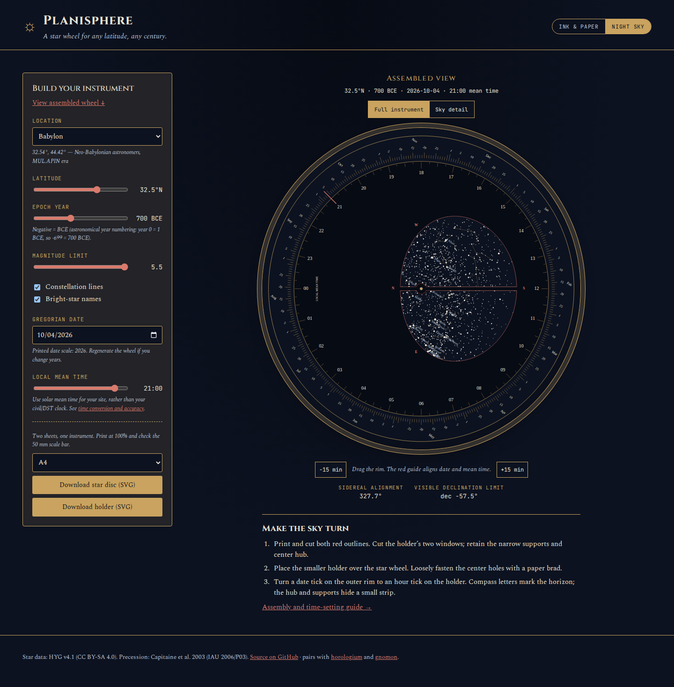
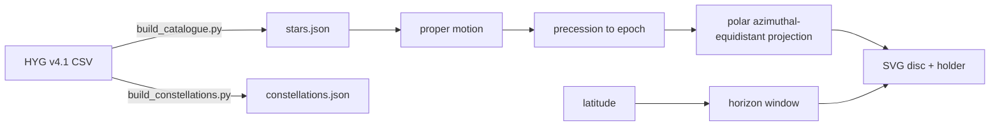

# Planisphere

**Print a star wheel for any latitude and any century.** See the sky over
Babylon in 700 BCE, then cut it out and turn it.

[](LICENSE)
[](https://antonsoo.github.io/planisphere/)

A planisphere is a rotating star chart: dial in a date and time and a window
shows the stars above your horizon. Every commercial one is printed for one
latitude and the present epoch. This app generates an accurate, printable,
laser-cuttable planisphere for **any latitude** and **any epoch from 3000
BCE to 3000 CE** — precession and proper motion included — so you can hold
the sky that Ptolemy, the Babylonian astronomers at Uruk, or the Maya
astronomers at Chichén Itzá actually saw. It pairs with the same owner's
[`horologium`](https://antonsoo.github.io/horologium/) (ancient calendars)
and [`gnomon`](https://antonsoo.github.io/gnomon/) (sundials).

<table>
<tr>
<td width="50%"></td>
<td width="50%"></td>
</tr>
<tr>
<td align="center"><em>Babylon, 32.5&deg;N — epoch 700 BCE</em></td>
<td align="center"><em>Babylon, 32.5&deg;N — epoch 2026 CE</em></td>
</tr>
</table>

Same latitude, same magnitude limit, 2726 years apart — precession visibly
shifts every star.

## Quickstart

```sh
git clone https://github.com/antonsoo/planisphere.git
cd planisphere && npm ci
npm run dev
```

Or just use the [live demo](https://antonsoo.github.io/planisphere/) — it's
a static site, nothing to install.

## Features

- **Bright-star catalogue**: 2,865 stars to magnitude 5.5, reduced from the
  HYG v4.1 database (RA/Dec J2000, proper motion, B-V colour index).
- **Precession + proper motion** for any epoch from 3000 BCE to 3000 CE
  (IAU 2006/P03 model), applied live as you move the epoch slider.
- **24 self-authored constellation figures** for the most recognizable
  constellations, every line endpoint verified against the catalogue.
- **Any latitude**, with a preset list including ancient sites: Babylon,
  Alexandria, Athens, Rome, Chichén Itzá, Tikal, Chang'an, Ujjain.
- **Live, rotatable SVG preview** — drag the rim to change local mean time,
  or use the keyboard time control and 15-minute buttons. The opaque holder,
  exposed daily date scale, and connected pivot match the printed assembly.
  **Sky detail** enlarges the windows for close inspection.
- **Ink & paper / night-sky themes**, keyboard-accessible, responsive down
  to 320px, with persistent theme selection.
- **Scale-exact SVG export** of the star disc and the horizon-window
  holder, sized for A4 or US Letter, with laser-cut colour conventions
  (red = cut, black = engrave), daily month/day marks, quarter-hour ticks,
  compass letters, bright-star names, and an independent 50 mm scale bar.



## How it works


```mermaid
flowchart LR
    A[HYG v4.1 CSV] -->|build_catalogue.py| B[stars.json]
    A -->|build_constellations.py| C[constellations.json]
    B --> D[proper motion]
    D --> E[precession to epoch]
    E --> F[polar azimuthal-\nequidistant projection]
    F --> G[SVG disc + holder]
    H[latitude] --> I[horizon window]
    I --> G
```

1. **Star data.** `scripts/build_catalogue.py` filters the HYG v4.1 CSV to
   stars brighter than magnitude 5.5 and writes a compact
   `public/data/stars.json` (RA/Dec J2000, proper motion in mas/yr,
   magnitude, B-V). `scripts/constellation_lines.py` +
   `scripts/build_constellations.py` resolve a self-authored set of
   constellation stick figures against the same catalogue — see
   [`docs/constellations.md`](docs/constellations.md) for why we didn't use
   a third-party line dataset and how every line endpoint is verified.
2. **Precession.** `src/astro/precession.ts` implements the classical
   zeta_A/z_A/theta_A rotation using the P03 model of
   [Capitaine, Wallace & Chapront (2003), A&A 412, 567-586](https://syrte.obspm.fr/iau2006/aa03_412_P03.pdf),
   adopted by IAU 2006 Resolution B1. Proper motion
   (`src/astro/properMotion.ts`) is applied first, at J2000, using the
   Hipparcos/HYG convention (`pmRa` already includes `cos(dec)`).
3. **Geometry.** The star disc uses a polar azimuthal-equidistant
   projection centred on the observer's elevated celestial pole, extending
   to the faintest declination that ever rises at that latitude. The disc
   is mirrored (plots `-RA`, not `RA`) so that a single physical rotation
   correctly aligns every star's hour angle at once — the horizon window is
   then a *fixed* shape, cut once per latitude. Full derivation, including
   where the date/hour rings come from, is in
   [`docs/geometry.md`](docs/geometry.md).
4. **Rendering & export.** `src/render/artwork.ts` supplies the same physical
   geometry and lettering to the preview and exports. A 192 mm rotating wheel
   exposes its date scale around a 160 mm opaque holder; two window cutouts
   retain a connected center hub. Constellation segments are clipped in their
   actual coordinates, and labels remain inside the sky field. See
   [`docs/assembly.md`](docs/assembly.md) for printing, cutting, and time setting.
5. **Recovery.** Catalogue responses are checked for HTTP errors, valid schema,
   unique star IDs, existing constellation endpoints, and bounded size. Stalled
   loads can be restarted and time out with retry. Invalid date drafts retain
   the last valid chart and pause downloads. After loading, calculations,
   themes, and exports work offline; only the theme preference is stored.

## Accuracy and limitations

- **Precession**: the P03 model is stated by its authors to be accurate to
  a few milliarcseconds per century near J2000, degrading gracefully over
  longer spans; it's explicitly designed to be usable "for a span of
  several millennia." This app's `precessionAngles()` is cross-checked
  against **pyerfa**'s independent C-library implementation
  (`erfa.p06e`) to sub-microarcsecond agreement across the app's full
  epoch range (`tests/fixtures/precession-angles.oracle.json`,
  generated by `scripts/generate_precession_fixtures.py`), and against
  Meeus's own worked example (*Astronomical Algorithms*, ch. 20, theta
  Persei to 2028 Nov 13.19) to within 0.15 arcsecond — the small gap is a
  measured, documented difference between the IAU 1976 model Meeus uses
  and the P03/2006 model this app uses, not a bug (see
  `tests/astro/precession.test.ts`). No frame-bias correction is applied
  (~20 mas fixed offset, irrelevant at print scale).
- **Proper motion** is a flat linear approximation (undo the `cos(dec)`
  projection, add `mu * dt`), not rigorous great-circle propagation. Over
  5000 years this is visibly wrong for the handful of very-high-proper-
  motion stars (e.g. Barnard's Star, ~10.3"/yr) but well under plotting
  precision for the vast majority of the catalogue.
- **Constellation lines** are self-authored from classical bright-star
  asterisms (see [`docs/constellations.md`](docs/constellations.md)), not
  the official 88-constellation IAU boundaries/figures — 24 of the most
  recognizable constellations are included, not all 88.
- **Date/hour rings** read local *mean solar time*, ignoring the equation
  of time (up to about &plusmn;16 minutes) and longitude/timezone — the same
  simplification every paper planisphere makes, because a printed ring
  can't encode either. Enter your own local mean time directly. The date
  marks are placed by the mean Sun and checked against an independent
  sidereal-time formula (`tests/geometry/dial.test.ts`); each mark stands
  for 0h UT, so a reading late in the day trails the sky by up to a degree
  (4 minutes).
- **The date ring is Gregorian and year-specific**, including leap day.
  Changing its year regenerates the annual scale. The star-position epoch
  remains a separate setting, so historical epochs can be compared on the
  same modern seasonal scale. The date input supports years 0001–9999;
  epoch selection supports 3000 BCE–3000 CE.
- **Geometric horizon**, not the atmospherically refracted one (about 34
  arcminutes higher in reality) — smaller than the drawn window line.
- At **the equator**, the window is constructed as a half-disc and checked
  against the altitude formula. The center hub and its two supports obscure
  part of the sky, including the elevated pole, as shown in the opaque
  preview. The UI latitude range is 89°S–89°N.
- Print files and assembled overlays have been checked digitally; a physical
  paper assembly or laser-cut trial has not yet been performed. Example
  SVG downloads and opaque print proofs are in the [assembly guide](docs/assembly.md).

## Data licenses

- **Star catalogue**: [HYG v4.1](https://github.com/astronexus/HYG-Database)
  (David Nash / AstroNexus), **CC BY-SA 4.0**. Vendored license text in
  `scripts/vendor/HYG_LICENSE.txt`; not redistributed raw (see
  `scripts/fetch_hygdata.sh`), only the reduced derivative in
  `public/data/stars.json`.
- **Constellation lines**: self-authored (see
  [`docs/constellations.md`](docs/constellations.md)), released under this
  repo's MIT license along with the code.
- **Code**: MIT, see [`LICENSE`](LICENSE).

## Testing

```sh
npm run test   # astro, geometry and export suites
npm run lint
npm run typecheck
npm run build
npx playwright install chromium firefox
npm run test:browser  # production build, Chromium and Firefox
```

- **Precession**: cross-checked against pyerfa/ERFA (independent library)
  and Meeus's published worked example (see Accuracy, above), plus
  round-trip tests (precess forward then back to J2000) for a range of
  stars and epochs.
- **Geometry**: horizontal/equatorial round trips; analytic altitude versus
  horizon polygons at the equator, near it, and in both hemispheres; physical
  cutouts versus that horizon minus the retained hub and support strip.
- **Export**: physical page-fit dimensions verified numerically, and the
  generated SVG markup itself is checked (correct millimetre sizing, cut
  paths in red, engraved marks in black, star count matches the magnitude
  filter) — `tests/render/export.test.ts`.

- **Production browsers**: actual SVG downloads, XML parsing, preview/export
  equivalence, exposed dates over full rotation, hub connectivity, glyph bounds,
  keyboard and pointer alignment, loading/retry/timeout recovery, invalid date
  drafts, offline work, and both themes at 1440, 375, and 320 pixels. Every
  workflow monitors page errors, CSP violations, and off-origin requests.
- The same suite can target the deployed site:
  `PLANISPHERE_BASE_URL=https://antonsoo.github.io/planisphere/ npm run test:browser`.

## Contributing

See [`CONTRIBUTING.md`](CONTRIBUTING.md).

## License

MIT, see [`LICENSE`](LICENSE). Star data is CC BY-SA 4.0 (see Data licenses,
above) — the code and the self-authored constellation lines are MIT, the
vendored star catalogue derivative keeps its original license.

---

<sub>Part of [Officina](https://antonsoo.github.io/officina/), a set of small open-source tools by [Anton Soloviev](https://github.com/antonsoo).</sub>
