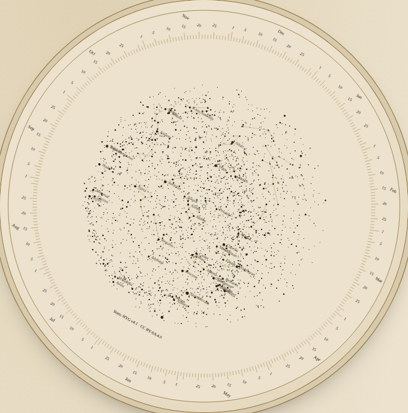
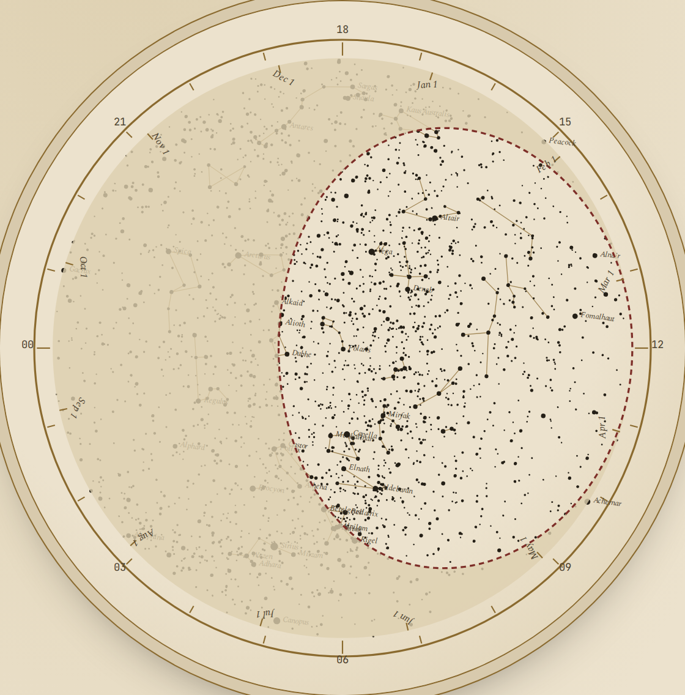
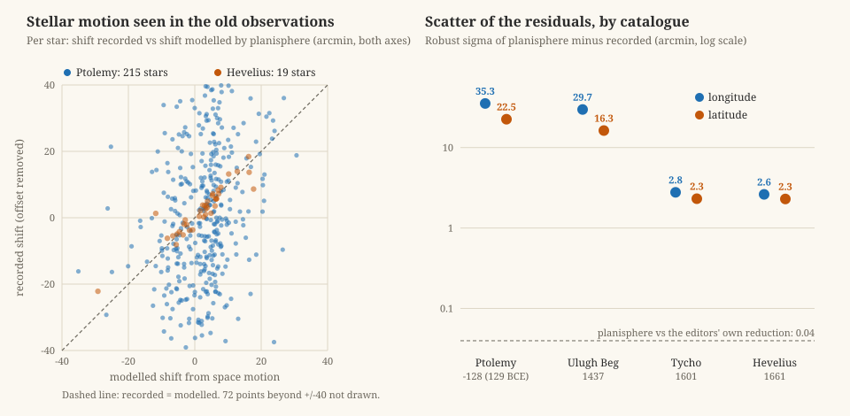
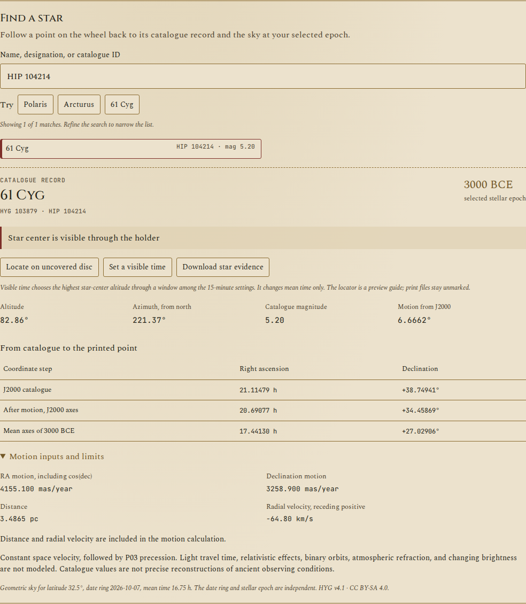
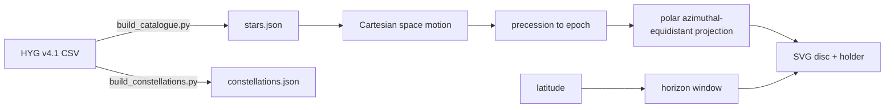

# Planisphere

**Print a star wheel and inspect the astronomy behind every point.**
Compare stellar epochs from 3000 BCE to 3000 CE, then cut out the instrument.

[](LICENSE)
[](https://antonsoo.github.io/planisphere/)

A planisphere is a rotating star chart: dial in a date and time and a window
shows the stars above your horizon. Its disc depends on latitude and stellar
epoch. This app generates both the disc and its physical holder, then lets
you trace a star from its catalogue record through motion and precession to
the printed point. The historical view is a model with explicit limits,
including an independent Gregorian date scale; it is not a reconstruction
of ancient observing conditions. It pairs with
[`horologium`](https://antonsoo.github.io/horologium/) (ancient calendars)
and [`gnomon`](https://antonsoo.github.io/gnomon/) (sundials).

<table>
<tr>
<td width="50%"></td>
<td width="50%"></td>
</tr>
<tr>
<td align="center"><em>Babylon, 32.5&deg;N — epoch 700 BCE</em></td>
<td align="center"><em>Babylon, 32.5&deg;N — epoch 2026 CE</em></td>
</tr>
</table>

Same latitude, same magnitude limit, 2726 years apart — precession visibly
shifts every star.

## Checked against what people measured

The pipeline was run at the epochs of Ptolemy's catalogue (-128 and AD 137),
Ulugh Beg's (1437), Tycho Brahe's (1601) and Hevelius's (1661), and compared
with about 4,200 recorded star positions that Verbunt and van Gent identified
with Hipparcos stars. Planisphere agrees with the editors' own per-star reduction (the same
Hipparcos data underneath) to a robust sigma of 0.04 arcminute at all four
epochs, with five exceptions among fast-moving Ptolemaic stars, by 1 to 19
arcminutes. The published longitude and latitude offsets are reproduced; the
longitude widths come out 10 to 20% wider, from the fitting. The scatter
against the recorded positions is the old observers' (robust sigma in
longitude 35 arcmin for Ptolemy, 30 for Ulugh Beg, 2.8 for Tycho, 2.6 for
Hevelius). Stellar motion is detectable in the old positions but the size is
loosely fixed: for the 94 Ptolemaic stars that the model says moved at least
10 arcminutes, recorded over modelled displacement is 0.94 (Theil-Sen,
95% interval 0.68 to 1.14) to 1.13 (least squares, 0.74 to 1.46), and one
star (HIP 71681) accounts for that gap. This is in the source checkout, not the released version.
Details, limits and the figure:
[`studies/historical-catalogues`](studies/historical-catalogues/README.md).

<picture>
  <source media="(prefers-color-scheme: dark)" srcset="docs/assets/historical-catalogues-dark.svg">
  
</picture>

## Quickstart

```sh
git clone https://github.com/antonsoo/planisphere.git
cd planisphere && npm ci
npm run dev
```

Or just use the [live demo](https://antonsoo.github.io/planisphere/) — it's
a static site, nothing to install.

## Features

- **Bright-star catalogue**: 2,865 stars to magnitude 5.5, reduced from the
  HYG v4.1 database (J2000 coordinates, proper motion, distance, radial
  velocity, and B-V colour index), with pinned source revision and checksum.
- **Precession + proper motion** for any epoch from 3000 BCE to 3000 CE
  (IAU 2006/P03 model), applied live as you move the epoch slider. Motion
  propagates a Cartesian space vector with perspective when distance and
  radial velocity are available.
- **Find and inspect a star** by name, designation, constellation or HIP/HYG
  ID. Lift the holder to locate it, see why it is hidden, choose a visible
  quarter-hour setting, and download the catalogue inputs and computed
  coordinates as JSON. The locator is excluded from print files.
- **24 self-authored constellation figures** for the most recognizable
  constellations, every line endpoint verified against the catalogue.
- **Any latitude**, with a preset list including ancient sites: Babylon,
  Alexandria, Athens, Rome, Chichén Itzá, Tikal, Chang'an, Ujjain.
- **Live, rotatable SVG preview** — drag the rim to change local mean time,
  or use the keyboard time control and 15-minute buttons. The opaque holder,
  exposed daily date scale, and connected pivot match the printed assembly.
  **Sky detail** enlarges the windows for close inspection.
- **Ink & paper / night-sky themes**, keyboard-accessible, responsive down
  to 320px, with persistent theme selection.
- **Scale-exact SVG export** of the star disc and the horizon-window
  holder, sized for A4 or US Letter, with laser-cut colour conventions
  (red = cut, black = engrave), daily month/day marks, quarter-hour ticks,
  compass letters, bright-star names, and an independent 50 mm scale bar.



Try **61 Cyg** at **3000 BCE** to see a large motion correction, or **Polaris**
at **2000 CE** to see a star that is above the horizon but hidden by the hub.
The [finder and motion guide](docs/stellar-motion.md) explains the states,
source data, downloadable evidence and numerical audit.

## How it works


```mermaid
flowchart LR
    A[HYG v4.1 CSV] -->|build_catalogue.py| B[stars.json]
    A -->|build_constellations.py| C[constellations.json]
    B --> D[Cartesian space motion]
    D --> E[precession to epoch]
    E --> F[polar azimuthal-\nequidistant projection]
    F --> G[SVG disc + holder]
    H[latitude] --> I[horizon window]
    I --> G
```

1. **Star data.** `scripts/build_catalogue.py` filters the HYG v4.1 CSV to
   stars brighter than magnitude 5.5 and writes a compact
   `public/data/stars.json` (RA/Dec J2000, proper motion in mas/yr,
   distance in parsecs, radial velocity in km/s, magnitude and B-V). Missing
   or dubious distances remain null. `scripts/constellation_lines.py` +
   `scripts/build_constellations.py` resolve a self-authored set of
   constellation stick figures against the same catalogue — see
   [`docs/constellations.md`](docs/constellations.md) for why we didn't use
   a third-party line dataset and how every line endpoint is verified.
2. **Precession.** `src/astro/precession.ts` implements the classical
   zeta_A/z_A/theta_A rotation using the P03 model of
   [Capitaine, Wallace & Chapront (2003), A&A 412, 567-586](https://syrte.obspm.fr/iau2006/aa03_412_P03.pdf),
   adopted by IAU 2006 Resolution B1. Proper motion
   (`src/astro/properMotion.ts`) is applied first, at J2000, using the
   Hipparcos/HYG convention (`pmRa` already includes `cos(dec)`). The
   tangent-vector formulation crosses coordinate poles without clamping.
   See [the derivation and ERFA comparison](docs/stellar-motion.md).
3. **Geometry.** The star disc uses a polar azimuthal-equidistant
   projection centred on the observer's elevated celestial pole, extending
   to the faintest declination that ever rises at that latitude. The disc
   is mirrored (plots `-RA`, not `RA`) so that a single physical rotation
   correctly aligns every star's hour angle at once — the horizon window is
   then a *fixed* shape, cut once per latitude. Full derivation, including
   where the date/hour rings come from, is in
   [`docs/geometry.md`](docs/geometry.md).
4. **Rendering & export.** `src/render/artwork.ts` supplies the same physical
   geometry and lettering to the preview and exports. A 192 mm rotating wheel
   exposes its date scale around a 160 mm opaque holder; two window cutouts
   retain a connected center hub. Constellation segments are clipped in their
   actual coordinates, and labels remain inside the sky field. See
   [`docs/assembly.md`](docs/assembly.md) for printing, cutting, and time setting.
5. **Recovery.** Catalogue responses are checked for HTTP errors, valid schema,
   unique star IDs, existing constellation endpoints, and bounded size. Stalled
   loads can be restarted and time out with retry. Invalid date drafts retain
   the last valid chart and pause downloads. After loading, calculations,
   themes, and exports work offline; only the theme preference is stored.

## Accuracy and limitations

- **Precession**: P03 classical Euler angles agree with ERFA's `p06e`
  implementation to sub-microarcsecond precision in the retained fixture.
  The full position pipeline also uses independent C-library matrix operations
  as a reference. A different IAU 2006 representation, ERFA's bias-removed
  Fukushima-Williams `pmat06`, differs by up to **9.42 arcseconds** across the
  sampled millennial epochs. Formula agreement does not establish physical
  accuracy over thousands of years. Frame bias, nutation and aberration are
  omitted. Meeus's theta Persei worked example remains a separate cross-check.
- **Stellar motion**: geometric, constant Cartesian space velocity, followed
  by precession. The complete catalogue at seven epochs gives **20,055
  comparisons** with ERFA `pmsafe`: maximum motion error **0.259403 arcsecond**.
  For 61 Cyg at 3000 BCE, the old angular-addition model missed by about
  **0.89 degrees**. Distance is unknown for **54** stars; these use a disclosed
  tangential fallback. Catalogue uncertainty, binary orbits, light-time,
  relativistic effects and changes in brightness are not modeled. These
  error numbers quantify agreement with a reference calculation using the
  same inputs. The [audit guide](docs/stellar-motion.md) includes commands and
  limitations. Agreement with what people recorded is measured separately,
  in [the historical-catalogue study](studies/historical-catalogues/README.md)
  (source checkout): positions at the catalogues' epochs differ from the
  editors' own reduction by a robust sigma of 0.04 arcminute (five fast
  stars differ by 1 to 19), and the residuals against the recorded positions are the catalogues' own (2.3 to
  2.8 arcminutes for Tycho and Hevelius, 16 to 35 for Ptolemy and Ulugh Beg).
  That checks the stars' positions, not horizon, refraction or visibility.
- **Constellation lines** are self-authored from classical bright-star
  asterisms (see [`docs/constellations.md`](docs/constellations.md)), not
  the official 88-constellation IAU boundaries/figures — 24 of the most
  recognizable constellations are included, not all 88.
- **Date/hour rings** read local *mean solar time*, ignoring the equation
  of time (up to about &plusmn;16 minutes) and longitude/timezone — the same
  simplification every paper planisphere makes, because a printed ring
  can't encode either. Enter your own local mean time directly. The date
  marks are placed by the mean Sun and checked against an independent
  sidereal-time formula (`tests/geometry/dial.test.ts`); each mark stands
  for 0h UT, so a reading late in the day trails the sky by up to a degree
  (4 minutes).
- **The date ring is Gregorian and year-specific**, including leap day.
  Changing its year regenerates the annual scale. The star-position epoch
  remains a separate setting, so historical epochs can be compared on the
  same modern seasonal scale. The date input supports years 0001–9999;
  epoch selection supports 3000 BCE–3000 CE.
- **Geometric horizon**: atmospheric refraction and observing conditions are
  omitted. Finder visibility describes the star center and the paper cutouts,
  not whether the star can actually be observed.
- At **the equator**, the window is constructed as a half-disc and checked
  against the altitude formula. The center hub and its two supports obscure
  part of the sky, including the elevated pole, as shown in the opaque
  preview. The UI latitude range is 89°S–89°N.
- Print files and assembled overlays have been checked digitally; a physical
  paper assembly or laser-cut trial has not yet been performed. Example
  SVG downloads and opaque print proofs are in the [assembly guide](docs/assembly.md).

## Data licenses

- **Star catalogue**: [HYG v4.1](https://github.com/astronexus/HYG-Database)
  (David Nash / AstroNexus), **CC BY-SA 4.0**. Vendored license text in
  `scripts/vendor/HYG_LICENSE.txt`; not redistributed raw (see
  `scripts/fetch_hygdata.sh`), only the reduced derivative in
  `public/data/stars.json`.
- **Constellation lines**: self-authored (see
  [`docs/constellations.md`](docs/constellations.md)), released under this
  repo's MIT license along with the code.
- **Code**: MIT, see [`LICENSE`](LICENSE).

## Testing

```sh
npm run test   # astro, geometry and export suites
npm run lint
npm run typecheck
npm run build
npx playwright install chromium firefox
npm run test:browser  # production build, Chromium and Firefox
```

- **Precession**: cross-checked against pyerfa/ERFA (independent library)
  and Meeus's published worked example (see Accuracy, above), plus
  round-trip tests (precess forward then back to J2000) for a range of
  stars and epochs.
- **Space motion**: 49 retained ERFA reference cases cover seven stars and
  seven epochs, with a separate script checking all 2865 stars. Pole crossings,
  missing distances and catalogue reference epochs are also exercised.
- **Geometry**: horizontal/equatorial round trips; analytic altitude versus
  horizon polygons at the equator, near it, and in both hemispheres; physical
  cutouts versus that horizon minus the retained hub and support strip.
- **Export**: physical page-fit dimensions verified numerically, and the
  generated SVG markup itself is checked (correct millimetre sizing, cut
  paths in red, engraved marks in black, star count matches the magnitude
  filter) — `tests/render/export.test.ts`.

- **Production browsers**: actual SVG downloads, XML parsing, preview/export
  equivalence, exposed dates over full rotation, hub connectivity, glyph bounds,
  keyboard and pointer alignment, loading/retry/timeout recovery, invalid date
  drafts, offline work, and both themes at 1440, 375, and 320 pixels. Every
  workflow monitors page errors, CSP violations, and off-origin requests.
  Finder downloads are compared with an ERFA reference and actual preview/print
  points; hub/window states, first-use offline search, escaped labels, invalid
  drafts, magnitude recovery and keyboard focus are exercised.
- The same suite can target the deployed site:
  `PLANISPHERE_BASE_URL=https://antonsoo.github.io/planisphere/ npm run test:browser`.

The [2026-10-08 verification record](docs/verification-2026-10-08.md) covers
the local unreleased finder/motion work, with reviewed screenshots and real
downloads. It does not assert that the live demo includes these changes.

## Contributing

See [`CONTRIBUTING.md`](CONTRIBUTING.md).

## License

MIT, see [`LICENSE`](LICENSE). Star data is CC BY-SA 4.0 (see Data licenses,
above) — the code and the self-authored constellation lines are MIT, the
vendored star catalogue derivative keeps its original license.

---

<sub>Part of [Officina](https://antonsoo.github.io/officina/), a set of small open-source tools by [Anton Soloviev](https://github.com/antonsoo).</sub>
